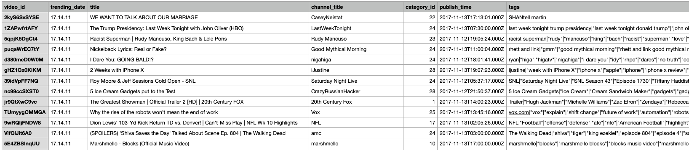

## Prepare the Data for Analysis
## Data Description

Before explaining the data preparation process, it is important to first understand the data, including its characteristics, timeframe and quality. This section provides an **overview** of the **2 datasets** extracted for this analysis using an R package.

### YouTube Trending Video Dataset

The first source of data is the **YouTube Trending Video Dataset** from Kaggle: \* **Source:** [YouTube Trending Video Dataset on Kaggle](https://www.kaggle.com/datasets/datasnaek/youtube-new). This dataset includes several months of data on daily trending YouTube videos. Data is included for many countries like the USA, UK, Mexico or Japan, with up to 200 listed trending videos per day.

-   **Key Variables (Raw):** Each region’s data is in a separate file. Data includes the video title, channel title, publish time, tags, views, likes and dislikes, description, and comment count.

-   **Data Volume:** The data spans the period from **2017-11-14 to 2018-06-14**, which defines the timeframe for this case study. According to the source, the original data was extracted using YouTube API. Data of 5 countries is selected for our study: the US, Japan, Mexico, Germany and France. After combining the 5 countries' files into one dataframe, we got 183,487 rows and 17 columns. Furthermore, after separating the multi-valued tags(keyword) for each videos into single rows, the dataframe has 3,002,056 rows and 17 columns.

-   **Initial Observations/Challenges:** The first challenge that we looked into was the `tags` column, which are the **topics/keywords** that we plan to filter and analyze. However there are many **tags** in each row, which means we will need to separate the individual tags using a delimiter.

{width="5000px,height=4000px"}

### Google Search Interest Dataset

We obtained this dataset by **extracting** Google search data ourselves, instead of using ready-to-use data.

-   **Source:** Google Trends, accessed via the `gtrendsR` R package.

-   **Key Variables (from `gtrendsR` output):**

    -   `date`: Date of search interest.
    -   `hits`: A Google defined index of search interest (0-100).
    -   `keyword`: The search term queried: iPhone, Rolex and Tesla.
    -   `geo`: Geographic region of the search (we only define 5 countries that we chose).

-   **Initial Observations:** After reading into the package information and data, we found out that: the hits(0-100) reflect relative search interest, not absolute search volume.

## Data Preparation and Cleaning

The data preparation and cleaning was done in a exploratory way, step by step, heading towards one goal: to have a data frame ready for merging with the Google dataset. To achieve that, we have then written down the exact data structure from both sides, which contain the exact information we want. To program that, the following was needed: group data, add and delete columns, filter and merge, etc.

In summary, our primary objective was to create a **unified dataset** that captures daily trending patterns for our **target keywords** (iPhone, Tesla, and Rolex) across five countries.

Following up, we will showcase our **YouTube Data Cleaning and Preprocessing**: 
- Combining Country-Specific Datasets: The initial data extraction have five separate country files. Our first critical step is to read and merge them into one **single data frame**. Therefore, the country codes "JP" "US" "DE" "FR" "MX" were added to the merged table. The resulting dataset contained 183,487 observations spanning from November 2017-11-14 to 2018-06-14 across all five countries.

- **Extracting and Preparing Keywords**: The `tags` column presented both a challenge and an opportunity. We found out that each video contained multiple tags separated by pipe characters.To solve the problem, we separated then the keyword(tags) for each videos as one individual row, using syntax like:

```{r showcase filter keyword}
#| eval: false
#| code-fold: true   # hide/unhide code chunk
#| code-summary: "Show/Hide the code" 
#### Filter for the three keywords and create a new 'keyword' column
relevant_videos <- tags_per_day %>%
  filter(grepl("iphone|tesla|rolex", tags, ignore.case = TRUE)) %>%
  mutate(keyword = case_when(
    grepl("iphone", tags, ignore.case = TRUE) ~ "iPhone",
    grepl("tesla", tags, ignore.case = TRUE) ~ "Tesla",
    grepl("rolex", tags, ignore.case = TRUE) ~ "Rolex",
    TRUE ~ "Other"
  ))
```


Then why is it an opportunity? Actually after separating the desired iPhone, Tesla and Rolex `tags`, we could even explore what `tags` are around these products. New types of graphs like word clouds could be made.


- **Engagement Metric Calculation:**
To measure audience engagement at a keyword level, new metrics were created.

To do that, firstly we aggregated the data and calculate two engagement ratios: `total_likes`/ `total_views` and `total_comments`/ `total_views`. These ratios provide insights into audience engagement (engagement quality) independent of video popularity. This valuable information helps companies to identify topics that can stimulate most engagement, and developing an efficient advertising strategy. 


- **Final dataset Integration:**
The final chapter of the data preparation phase is the creation of a single, comprehensive dataset, combining the YouTube data structure and the Google search data.

- **Merging Strategy: **
The processed YouTube and Google Trend dataset were combined using a `full_join`  (including trending dates, video metrics, and extracted tags, calculated engagement ratios, keyword, country) with the Google Trends search interest data. In case on a day, there is Google trend data for a keyword, but no trending video on YouTube, the metrics will be value 0. An extra column is also added, marking if the day has trending video or not. This method ensures that all data points from both sources are retained, **preventing any loss of information**.

- **Join Keys:** The join should be performed on common identifiers such as keyword/tag and date.


- **Resulting dataset:** the structure of the final merged data is

\[1\] "trending_date" "country" "keyword" "total_views"\
\[5\] "total_likes" "total_dislikes" "total_comments" "video_count"\
\[9\] "like_dislike_ratio" "comments_views_ratio" "likes_views_ratio" "dislikes_views_ratio" 
\[13\] "hits" "youtube_status"

